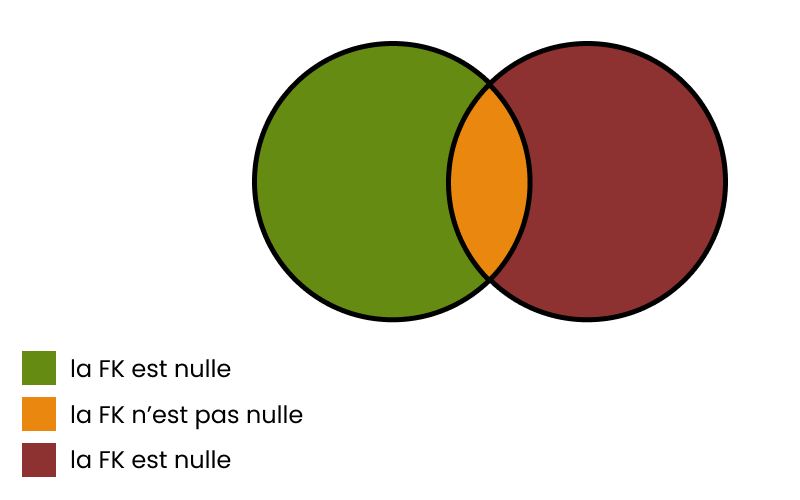
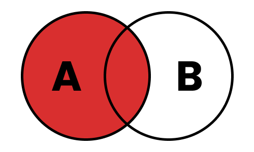
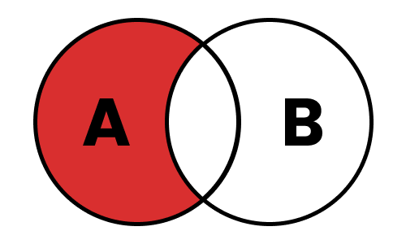
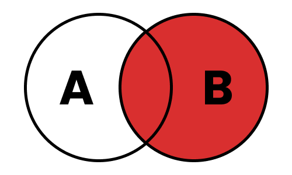
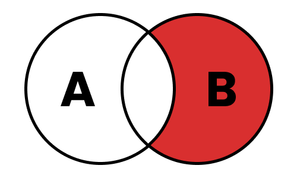
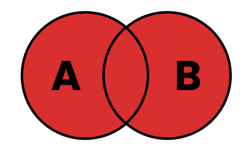
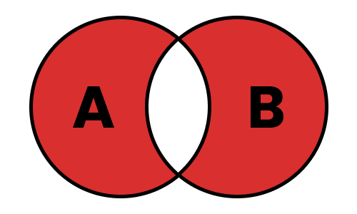
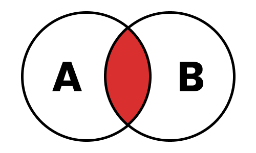

# MDS-2526-B3-DW-SQL

## Liens utiles

- `https://sql.sh` : cours global pour les requêtes
- `https://github.com/Microleadoff/database-installer-py` : lien de l'installateur des 4 BDD en python
- `https://cartman34.fr/wp-content/uploads/2017/01/sql_joins.jpg`, `https://miro.medium.com/v2/0*bkfApXMFeO1E7Pom.png` : images sur les jointures

### Ordre des mots-clés dans une requête

```sql
SELECT *
FROM table
WHERE condition
GROUP BY expression
HAVING condition
{ UNION | INTERSECT | EXCEPT }
ORDER BY expression
LIMIT count
OFFSET start
```

### Description des instructions

- `SELECT DISCINCT` : supprime les doublons
- `WHERE` : permet de poser une condition - filtrer les résultats. Les opérateurs possibles utilisables avec la clause WHERE :

| Opérateur  | Description                                                       |
|------------|-------------------------------------------------------------------|
| =          | Égale                                                             |
| <>         | Pas égale                                                         |
| !=         | Pas égale                                                         |
| >          | Supérieur à                                                       |
| <          | Inférieur à                                                       |
| >=         | Supérieur ou égale à                                              |
| <=         | Inférieur ou égale à                                              |
| IN         | Liste de plusieurs valeurs possibles                              |
| BETWEEN    | Valeur comprise dans un intervalle donnée (utile pour les nombres ou dates) |
| LIKE       | Recherche en spécifiant le début, milieu ou fin d'un mot          |
| IS NULL    | Valeur est nulle                                                  |
| IS NOT NULL| Valeur n'est pas nulle                                            |

-  `WHERE ... AND ...` : Permet d'ajouter plusieurs conditions 
-  `WHERE ... OR ...` : Permet d'ajouter plusieurs conditions optionnelles
-  `WHERE ... IN ...` : Permet de filtrer sur une liste d'éléments
-  `WHERE ... BETWEEN ...` : Permet de filtrer entre 2 valeurs
-  `WHERE ... IS NULL ...` : Permet de filtrer sur les champs "NULL"
-  `WHERE ... LIKE ...` : Permet de filtrer sur les chaines de caractères. Voici les utilisations possibles

| Modèle        | Description                                                                 | Exemples correspondants       |
|---------------|-----------------------------------------------------------------------------|--------------------------------|
| `LIKE '%a'`   | Recherche toutes les chaînes qui **se terminent par “a”**                   | `pizza`, `salsa`              |
| `LIKE 'a%'`   | Recherche toutes les chaînes qui **commencent par “a”**                     | `avion`, `arbre`              |
| `LIKE '%a%'`  | Recherche toutes les chaînes qui **contiennent “a”**                        | `chat`, `manger`              |
| `LIKE 'pa%on'`| Recherche les chaînes qui **commencent par “pa” et se terminent par “on”**  | `pantalon`, `pardon`          |
| `LIKE 'a_c'`  | Le caractère `_` représente **un seul caractère** (contrairement à `%`)     | `aac`, `abc`, `azc`           |


## Les premières instructions

### Jouer avec les bases de données

- `SHOW DATABASES` : Permet de voir la liste des BDD
- `CREATE DATABASE <name>` : Permet de créer une BDD
- `USE <database>` : Permet de "rentrer" dans une BDD en CLI pour interagir avec
- `DROP DATABASE <name>` : Permet de supprimer une BDD

### Jouer avec les tables

- `CREATE TABLE <table>` : Permet de créer une table
- `ALTER TABLE <table>` : Permet de MAJ une table
- `DROP TABLE <table>` : Permet de supprimer une table
- `SHOW TABLES` : Permet de voir la liste des tables
- `DESCRIBE <table>` : Permet de décrire les colonnes d'une table
- `TRUNCATE <table>` : Supprime les données dans une table

### Jouer avec les données

- `INSERT INTO <table> (colonne1, colonne2, ...) VALUES ('valeur 1', 'valeur 2', ...)` : Permet d'insérer des données dans une table
- `UPDATE <table> SET colonne1 = 'nouvelle valeur' WHERE ...` : Permet de mettre à jour des données dans une table
- `DELETE FROM <table> WHERE ....` : Permet de supprimer des données dans une table

## Exemples de requetes pour pratiquer sur la BDD WORLD

- `SELECT DISTINCT state_code FROM cities;` (1185)
- `SELECT * FROM cities WHERE state_code = "07";` (435)
- `SELECT * FROM cities WHERE state_code = "07" AND country_code = "AD";` (0)
- `SELECT * FROM cities WHERE state_code = "07" OR country_code = "AD";` (444)
- `SELECT * FROM cities WHERE latitude > 42 AND longitude > 1.5;` (53085)
- `SELECT * FROM cities WHERE latitude < 20 AND longitude > 50;` (15814)
- `SELECT * FROM cities WHERE latitude > 42 AND longitude > 1.5 OR latitude < 20 AND longitude > 50;` (68899)
- `SELECT * FROM cities WHERE (latitude > 42 AND longitude > 1.5) OR (latitude < 20 AND longitude > 50);` (68899)
- `SELECT * FROM cities WHERE country_code IN ("AD", "AE");` (49)
- `SELECT * FROM cities WHERE latitude BETWEEN 20 AND 30;` (10235)
- `SELECT * FROM countries WHERE wikiDataId IS NULL;` (47)
- `SELECT * FROM countries WHERE wikiDataId IS NOT NULL;` (203)
- `SELECT * FROM cities WHERE name LIKE 'a%';` (9002)
- `SELECT * FROM cities WHERE name LIKE '%a';` (25624)
- `SELECT * FROM cities WHERE name LIKE '%zw%';` (76)
- `SELECT * FROM cities WHERE name LIKE '%c_t%';` (1973)

## Explication des sous-requêtes

- Ce sont des requêtes imbriquées
- Il faut les mettre entre parenthèses pour ne pas créer de bug

Exemple : 

```SQL

-- Requete 1 : on récupère toutes les villes
SELECT * FROM city;

-- Requete 2 : on récupère tous les pays dont le nom contient "au"
SELECT country_id FROM country WHERE country LIKE "%au%";

-- Requete 3 : on veut toutes les villes qui appartiennent à un pays dont le nom contient "au"
SELECT * FROM city WHERE country_id IN (
    SELECT country_id FROM country WHERE country LIKE "%au%"
);

```

## Explication des jointures

### Généralités 

- Permet de récupérer des données reliées entre plusieurs tables
- Comment savoir quelle table est à gauche ou à droite : la première indiquée est écrite à gauche de l'autre : c'est donc la table de gauche
- 4 types de jointure différents
    - LEFT : récupère les informations de la table de gauche, et les lie avec la table de droite
    - RIGHT : récupère les informations de la table de droite, et les lie avec la table de gauche
    - INNER : récupère les informations des tables de gauche ET de droite, dont la FK n'est pas nulle
    - OUTER : récupère les informations des tables de gauche et de droite

Quelques rappels **SIMPLES** pour la gestion des foreign keys dans les relations : 



### LEFT INCLUSIVE



Récupère toutes les lignes de la table de gauche, ainsi que les lignes de la table de droite dont la Foreign Key n'est pas nulle

Exemple de requête générique : 

```SQL
SELECT [LIST] FROM TableA as A LEFT JOIN TableB as B ON A.Foreignkey = B.Foreignkey;
```

Exemple de requête dans la BDD SAKILA : 

```SQL
SELECT * FROM film AS A LEFT JOIN language AS B ON A.language_id = B.language_id;
```

### LEFT EXCLUSIVE



Récupère toutes les lignes de la table de gauche, dont la Foreign Key de la table de droite est nulle.

Exemple de requête générique : 

```SQL
SELECT [LIST] FROM TableA as A LEFT JOIN TableB as B ON A.Foreignkey = B.Foreignkey WHERE B.Foreignkey IS NULL;
```

Exemple de requête dans la BDD SAKILA : 

```SQL
SELECT * FROM film AS A LEFT JOIN language AS B ON A.language_id = B.language_id WHERE B.language_id IS NULL;
```

### RIGHT INCLUSIVE



Récupère toutes les lignes de la table de droite, ainsi que les lignes de la table de gauche dont la Foreign Key n'est pas nulle

Exemple de requête générique : 

```SQL
SELECT [LIST] FROM TableA as A RIGHT JOIN TableB as B ON A.Foreignkey = B.Foreignkey;
```

Exemple de requête dans la BDD SAKILA : 

```SQL
SELECT film.title, language.name FROM language RIGHT JOIN film ON film.original_language_id = language.language_id;
```

### RIGHT EXCLUSIVE



Récupère toutes les lignes de la table de droite, dont la Foreign Key de la table de gauche est nulle.

Exemple de requête générique : 

```SQL
SELECT [LIST] FROM TableA as A RIGHT JOIN TableB as B ON A.Foreignkey = B.Foreignkey WHERE A.Foreignkey IS NULL;
```

Exemple de requête dans la BDD SAKILA : 

```SQL
SELECT film.title, language.name FROM language RIGHT JOIN film ON film.original_language_id = language.language_id WHERE film.original_language_id IS NULL;
```

### FULL OUTER INCLUSIVE



Récupère toutes les lignes des tables de droite et de gauche.

Exemple de requête générique : 

```SQL
SELECT [LIST] FROM TableA as A FULL OUTER JOIN TableB as B ON A.Foreignkey = B.Foreignkey;
```

### FULL OUTER EXCLUSIVE



Récupère toutes les lignes des tables de droite et de gauche, dont la Foreign Key de la table de gauche n'est pas nulle.

Exemple de requête générique : 

```SQL
SELECT [LIST] FROM TableA as A FULL OUTER JOIN TableB as B ON A.Foreignkey = B.Foreignkey WHERE A.Foreignkey IS NULL OR B.Foreignkey IS NULL;
```

### INNER



Récupère toutes les lignes des tables de droite et de gauche, dont la Foreign Key entre les deux tables n'est pas nulle.

Exemple de requête générique : 

```SQL
SELECT [LIST] FROM TableA as A INNER JOIN TableB as B ON A.Foreignkey = B.Foreignkey;
```

Exemple de requête dans la BDD SAKILA : 

```SQL
SELECT * FROM city INNER JOIN country ON city.country_id = country.country_id;
```


## Explication des contraintes

- C'est une règle qui concerne une ou plusieurs colonne(s). Elle existe souvent quand on a une clé étrangère.
- On peut en avoir autant qu'on le souhaite
- Elle a 3 propriétés : 
    - Un nom pour l'identifier.
    - `ON DELETE` : l'action effectuée lors de la suppression d'une ligne concernée par la contrainte
    - `ON UPDATE` : l'action effectuée lors de la modification d'une ligne concernée par la contrainte

Il existe 4 possibilités de traitement pour les `ON UPDATE` & `ON DELETE` : 
- `CASCADE` : lors d’un `UPDATE` de la clé primaire, la valeur est répercutée dans toutes les clés étrangères correspondantes ; lors d’un `DELETE`, toutes les lignes enfants référencées sont supprimées.
- `SET NULL` : lors d’un `UPDATE` ou d’un `DELETE`, les colonnes de clé étrangère des lignes enfants sont remplacées par `NULL` (si elles l’acceptent).
- `RESTRICT` : blocage instantané.
- `NO ACTION` : blocage seulement à la validation de la transaction.

# TP

Réaliser les requêtes suivantes, en individuel, et noter le nombre de résultat de vos requêtes pour chacune (gradez une trace de vos requêtes quand meme), en travaillant sur la base de données `EMPLOYEES` : 

- Sélectionner tous les employés
```SQL
SELECT * from employees; (299290)
```
- Sélectionner tous les employés par leurs noms et prénoms
```SQL
SELECT first_name, last_name from employees; (299290)
```
- Sélectionner les noms distincts des employés
```SQL
SELECT DISTINCT last_name from employees; (1637)
```
- Sélectionner les noms et prénoms distincts des employés
```SQL
SELECT DISTINCT first_name, last_name from employees; (279408)
```
- Sélectionner les noms et prénoms des employés dont le nom est « alencar »
```SQL
SELECT first_name, last_name from employees WHERE last_name = 'alencar'; (170)
```
- Sélectionner les employés dont le nom est « alencar » et de sexe masculin
```SQL
SELECT first_name, last_name from employees WHERE last_name = 'alencar' AND gender = 'M'; (103)
```
- Sélectionner les employés dont le prénom « Danai » ou « Leen » en utilisant « OR »
```SQL
SELECT first_name from employees WHERE first_name = 'Danai' OR first_name = 'Leen'; (495)
```
- Sélectionner les employés dont le prénom « Danai » ou « Leen » en utilisant « IN »
```SQL
SELECT first_name from employees WHERE first_name IN ('Danai', 'Leen'); (495)
```
- Sélectionner les employés dont le nom est « alencar » et le prénom « Danai » ou « Leen » en utilisant « OR »
```SQL
SELECT first_name, last_name from employees WHERE last_name = 'alencar' AND first_name = 'Danai' OR first_name = 'Leen'; (248)
```
- Sélectionner les employés dont le nom est « alencar » et le prénom « Danai » ou « Leen » en utilisant « IN »
```SQL
SELECT first_name, last_name from employees WHERE last_name = 'alencar' AND first_name IN('Danai', 'Leen'); (4)
```
- Sélectionner les employés dont le numéro d’employé est compris entre 50000 et 50150
```SQL
SELECT * from employees where emp_no BETWEEN 50000 AND 50150; (151)
```
- Sélectionner les employés dont le nom est « alencar » et le numéro d’employé est compris entre 50000 et 60000
```SQL
SELECT * from employees where last_name = 'alencar' AND emp_no BETWEEN 50000 AND 60000; (6)
```
- Sélectionner les employés dont le nom est « alencar » et le prénom est « danai » ou le numéro d’employé est compris entre 50000 et 60000
```SQL
SELECT * from employees where last_name = 'alencar' AND emp_no BETWEEN 50000 AND 60000; (6)
```
- Sélectionner les employés dont le nom est « alencar » ou, le prénom est « danai » ou « leen » et le numéro d’employé est compris entre 50000 et 60000
```SQL
SELECT * from employees where last_name = 'alencar' AND first_name IN ('danai','leen') AND emp_no BETWEEN 50000 AND 60000; (1)
```
- Sélectionner les employés dont le prénom commence par un « T »
```SQL
SELECT * FROM employees WHERE first_name LIKE 'T%';(15139)
```

- Sélectionner les employés masculin dont la deuxième lettre du prénom est un « T »
```SQL
SELECT * FROM employees WHERE first_name LIKE 'T%';(3014)
```
- Sélectionner les employés dont le nom est « alencar » et le prénom « danai » ou le numéro d’employé commence par un 5
```SQL
SELECT * FROM employees WHERE last_name = 'alencar' AND first_name = 'danai' OR emp_no LIKE '5%'; (10001)
```
- Sélectionner les employés dont le prénom commence par un « T » et termine par un « B »
```SQL
SELECT * FROM `employees` WHERE first_name LIKE 't%b';(246)
```
- Sélectionner les employés dont le prénom commence par un « T », la 3ème lettre est un « R »
```SQL
SELECT * FROM `employees` WHERE first_name LIKE 't_r%'; (938)
```
- Sélectionner les employés dont le prénom commence par un « T », la 3ème lettre est un « R » et le numéro d’employé est compris entre 50000 et 60000
```SQL
SELECT * FROM `employees` WHERE first_name LIKE 't_r%' AND emp_no BETWEEN 50000 AND 60000; (34)
```
- Sélectionner les employés dont le prénom contient « TZV »
```SQL
SELECT * FROM `employees` WHERE last_name LIKE 'tzv'; (241)
```
- Sélectionner les employés masculin ou dont le numéro d’employé est compris entre 50000 et 60000 et, le prénom contient « TZV »
```SQL
SELECT * FROM `employees` WHERE gender ='M' OR last_name LIKE '%t%z%v%' AND emp_no BETWEEN 50000 AND 60000;(179979)
```
- Sélectionner les employés dont le prénom termine par « CAL»
```SQL
SELECT * FROM `employees` WHERE first_name LIKE '%cal'; (439)
```
- Sélectionner les employés dont le prénom termine par « CAL» de genre masculin et dont le numéro d’employé est compris entre 50000 et 60000
```SQL
SELECT * FROM `employees` WHERE first_name LIKE '%cal' AND gender = 'M' and emp_no BETWEEN 50000 AND 60000; (6)
```
- Sélectionner les employés dont le prénom est « danai » ou « leen » et le nom se termine par « TH» ou dont le numéro d’employé est compris entre 50000 et 100000
```SQL
SELECT * FROM `employees` WHERE first_name IN ('danai', 'leen') AND last_name LIKE '%th' OR emp_no BETWEEN 50000 AND 60000;(10003)
```
- Sélectionner les employés dont la date de naissance est null
```SQL
SELECT * FROM employees WHERE birth_date IS NULL; (0)
```


### Requetes simples partie 2

- Sélectionner le nombre d’employés par département
```SQL
SELECT dept_no, COUNT(emp_no) AS nb_emp from dept_emp GROUP BY dept_no; (9)
```
- Sélectionner le salaire maximum et minimum des employés
```SQL
SELECT MIN(salary), MAX(salary) FROM salaries; (1)
```
- Sélectionner le salaire maximum et minimum par employés
```SQL
SELECT emp_no, MIN(salary), MAX(salary) FROM salaries GROUP BY emp_no; (300024)
```
- Sélectionner la moyenne de salaire par employés
```SQL
SELECT emp_no, AVG(salary) FROM salaries GROUP BY emp_no; (300024)
```
- Sélectionner la moyenne de salaire par employés si leur numéro contient « 150 »
```SQL
SELECT emp_no, AVG(salary) FROM salaries GROUP BY emp_no HAVING AVG(salary) LIKE '%150%'; (620)
```
- Sélectionner le nombre d’employés par département avec un résumé général
```SQL
SELECT dept_no, COUNT(emp_no) FROM dept_emp GROUP BY dept_no WITH ROLLUP; (10)
```
- Sélectionner le nombre d’employés par département si leur numéro d’employé est compris entre 10000 et 50000
```SQL
SELECT dept_no, COUNT(emp_no) FROM dept_emp WHERE emp_no BETWEEN 10000 AND 50000 GROUP BY dept_no; (10)
```

- Sélectionner la moyenne, le minimum et le maximum des salaires par employé si leur numéro est compris entre 10005 et 10105 avec un résumé général
```SQL
SELECT emp_no, MIN(salary), MAX(salary), AVG(salary) FROM salaries WHERE emp_no BETWEEN 10005 AND 10105 GROUP BY emp_no WITH ROLLUP (102)
```

- Sélectionner le nombre d’employés par département pour les départements « d005 » et « d006 »
```SQL
SELECT dept_no, COUNT(*) AS nb_employes FROM dept_emp WHERE dept_no IN ('d005', 'd006') GROUP BY dept_no; (102)
```
- Sélectionner le nombre d’employés par département s’il est inférieur à 50000
```SQL
SELECT dept_no, COUNT(emp_no) AS nb_emp from dept_emp GROUP BY dept_no HAVING COUNT(*) < 50000; (6)
```
- Sélectionner la moyenne des salaires par employé si elle est comprise entre 40000 et 50000
```SQL
SELECT emp_no, AVG(salary) FROM salaries GROUP BY emp_no HAVING AVG(salary) BETWEEN 40000 AND 50000; (77853)
```
- Sélectionner la liste des employées en ordre alphabétique inversé de nom
```SQL
SELECT * from employees ORDER BY last_name DESC;(299290)
```
- Sélectionner la liste des employés en ordre alphabétique inversé de nom et en ordre alphabétique par prénom
```SQL
SELECT * from employees ORDER BY last_name DESC, first_name ASC;(299290)
```
- Sélectionner le nombre d’employés par département du plus petit au plus grand
```SQL
SELECT dept_no, COUNT(emp_no) AS nb_emp from dept_emp GROUP BY dept_no ORDER BY COUNT(emp_no) ASC; (9)
```

- Sélectionner le salaire maximum et minimum des employés, utiliser des alias
```SQL
SELECT MAX(s.salary) AS Salaire_Maximum, MIN(s.salary) AS Salaire_Minimum FROM salaries s; (1)
```


- Sélectionner les 10 premiers employés
```SQL
SELECT * FROM employees LIMIT 10; (10)

```
- Sélectionner les noms et prénoms des 10 premiers employés, utiliser des alias
```SQL
SELECT e.first_name AS Prenom, e.last_name AS Nom FROM employees e LIMIT 10; (10)

```
- Sélectionner 10 employés à partir du 5ème

```SQL
SELECT * FROM employees LIMIT 4, 10;(10)

```
- Sélectionner les noms et prénoms des 10 premiers employés en ordre alphabétique par nom

```SQL
SELECT e.first_name AS Prenom, e.last_name AS Nom FROM employees e ORDER BY e.last_name ASC LIMIT 10; (10)
```
- Sélectionner la somme des salaires pour les 10 premiers employés si la somme est inférieure à 50000

```SQL
SELECT e.emp_no, SUM(s.salary) AS Somme_Salaires
FROM employees e
JOIN salaries s ON e.emp_no = s.emp_no
GROUP BY e.emp_no
HAVING Somme_Salaires < 50000
LIMIT 10; (10)
```
- Sélectionner la somme des salaires par employés si leur numéro est compris entre 10001 et 50000 et la somme est inférieure à 50000

```SQL
SELECT e.emp_no, SUM(s.salary) AS Somme_Salaires
FROM employees e
JOIN salaries s ON e.emp_no = s.emp_no
WHERE e.emp_no BETWEEN 10001 AND 50000
GROUP BY e.emp_no
HAVING Somme_Salaires < 50000; (591)
```
- Sélectionner la somme des salaires pour les 10 premiers employés si leur numéro est compris entre 10001 et 50000 et la somme est inférieure à 50000

```SQL
SELECT e.emp_no, SUM(s.salary) AS Somme_Salaires
FROM employees e
JOIN salaries s ON e.emp_no = s.emp_no
WHERE e.emp_no BETWEEN 10001 AND 50000
GROUP BY e.emp_no
HAVING Somme_Salaires < 50000
LIMIT 10; (10)
```
- Sélectionner les employés et afficher les catégories de département (d001 = « Département n°1 », d002 = « Département n°2 », …, d009 = « Département n°9 » et s’il n’y a pas de département) si le numéro d’employé est compris entre 10150 et 10200

```SQL
SELECT e.emp_no, e.first_name, e.last_name,
       CASE d.dept_no
           WHEN 'd001' THEN 'Département n°1'
           WHEN 'd002' THEN 'Département n°2'
           WHEN 'd003' THEN 'Département n°3'
           WHEN 'd004' THEN 'Département n°4'
           WHEN 'd005' THEN 'Département n°5'
           WHEN 'd006' THEN 'Département n°6'
           WHEN 'd007' THEN 'Département n°7'
           WHEN 'd008' THEN 'Département n°8'
           WHEN 'd009' THEN 'Département n°9'
           ELSE 'Aucun département'
       END AS Categorie_Departement
FROM employees e
LEFT JOIN dept_emp de ON e.emp_no = de.emp_no
LEFT JOIN departments d ON de.dept_no = d.dept_no
WHERE e.emp_no BETWEEN 10150 AND 10200; (57)

```
- Sélectionner le nombre d’employés par département et afficher les catégories : supérieur à 50000 = « Élevé », supérieur ou égale à 20000 = « Correct », inférieur à 20000 = « Faible », utiliser des alias

```SQL
SELECT d.dept_no, COUNT(de.emp_no) AS Nb_Employes,
       CASE
           WHEN COUNT(de.emp_no) > 50000 THEN 'Élevé'
           WHEN COUNT(de.emp_no) >= 20000 THEN 'Correct'
           ELSE 'Faible'
       END AS Categorie
FROM dept_emp de
JOIN departments d ON de.dept_no = d.dept_no
GROUP BY d.dept_no; (9)
```
- Sélectionner les moyennes des salaires par employés et afficher les catégories : supérieur à 100000 = « Très élevée », supérieur ou égale à 80000 = « Élevée », inférieur à 80000 = « Faible », utiliser des alias

```SQL

SELECT e.emp_no, AVG(s.salary) AS Moyenne_Salaire,
       CASE
           WHEN AVG(s.salary) > 100000 THEN 'Très élevée'
           WHEN AVG(s.salary) >= 80000 THEN 'Élevée'
           ELSE 'Faible'
       END AS Categorie
FROM employees e
JOIN salaries s ON e.emp_no = s.emp_no
GROUP BY e.emp_no; (300024)

```

### Requetes à faire obligatoirement avec des jointures


- Sélectionner les noms, prénoms et numéros des employés et leur département actuel (INNER JOIN)

```SQL
SELECT e.emp_no, e.first_name, e.last_name, d.dept_name
FROM employees e
INNER JOIN dept_emp de ON e.emp_no = de.emp_no
INNER JOIN departments d ON de.dept_no = d.dept_no
WHERE de.to_date = '9999-01-01'; (240124)
```
- Sélectionner les prénoms, noms et titres actuels des employés (INNER JOIN)

```SQL
SELECT e.first_name, e.last_name, t.title
FROM employees e
INNER JOIN titles t ON e.emp_no = t.emp_no
WHERE t.to_date = '9999-01-01'; (240124)
```
- Sélectionner les noms, prénoms et salaires des employés en Juin 1989 (INNER JOIN)

```SQL
SELECT e.first_name, e.last_name, s.salary
FROM employees e
INNER JOIN salaries s ON e.emp_no = s.emp_no
WHERE '1989-06-01' BETWEEN s.from_date AND s.to_date;(84382)
```
- Sélectionner les noms, prénoms et départements actuels des managers (INNER JOIN)

```SQL
SELECT e.first_name, e.last_name, d.dept_name
FROM employees e
INNER JOIN dept_manager dm ON e.emp_no = dm.emp_no
INNER JOIN departments d ON dm.dept_no = d.dept_no
WHERE dm.to_date = '9999-01-01';(9)

```
- Sélectionner les noms, prénoms et dates de début d'emploi des employés avec leur département (INNER JOIN)

```SQL
SELECT e.first_name, e.last_name, e.hire_date, d.dept_name
FROM employees e
INNER JOIN dept_emp de ON e.emp_no = de.emp_no
INNER JOIN departments d ON de.dept_no = d.dept_no; (331603)
```
- Sélectionner les noms et départements des employés ayant le même département que les managers ayant été embauchés après le 1er Janvier 1996 (INNER JOIN et Sous-requêtes)

```SQL
SELECT e.first_name, e.last_name, d.dept_name
FROM employees e
INNER JOIN dept_emp de ON e.emp_no = de.emp_no
INNER JOIN departments d ON de.dept_no = d.dept_no
WHERE d.dept_no IN (
    SELECT dm.dept_no
    FROM dept_manager dm
    JOIN employees m ON dm.emp_no = m.emp_no
    WHERE m.hire_date > '1996-01-01'
);(0)
```
- Sélectionner les employés et leur date d'embauche dans les départements où le salaire moyen est supérieur à 80000 (INNER JOIN et Sous-requêtes)

```SQL
SELECT e.emp_no, e.first_name, e.last_name, e.hire_date
FROM employees e
JOIN dept_emp de ON e.emp_no = de.emp_no
WHERE de.dept_no IN (
    SELECT dept_no
    FROM dept_emp de2
    JOIN salaries s ON de2.emp_no = s.emp_no
    GROUP BY dept_no
    HAVING AVG(s.salary) > 80000
);(52245)
```
- Sélectionner les employés et les départements (CROSS JOIN)

```SQL
SELECT e.first_name, e.last_name, d.dept_name
FROM employees e CROSS JOIN departments d; (2700216)
```
- Sélectionner les postes actuels des employés avec les noms des départements (CROSS JOIN)

```SQL
SELECT DISTINCT t.title, d.dept_name
FROM titles t CROSS JOIN departments d; (63)
```
- Sélectionner les dates d'emploi des employés et les noms des départements (JOIN et CROSS JOIN)

```SQL
SELECT e.emp_no, de.from_date, de.to_date, d.dept_name
FROM employees e
JOIN dept_emp de ON e.emp_no = de.emp_no
CROSS JOIN departments d; (2984427)
```
- Sélectionner les noms, prénoms, dates d’embauche et départements des employés même s’ils n’ont pas de département associé (LEFT JOIN)

```SQL
SELECT e.first_name, e.last_name, e.hire_date, d.dept_name
FROM employees e
LEFT JOIN dept_emp de ON e.emp_no = de.emp_no
LEFT JOIN departments d ON de.dept_no = d.dept_no; (331603)
```
- Sélectionner les noms, prénoms et titres des employés même s’ils n’ont pas de titre associé (LEFT JOIN)

```SQL
SELECT e.first_name, e.last_name, t.title
FROM employees e
LEFT JOIN titles t ON e.emp_no = t.emp_no; (443308)
```
- Sélectionner les noms, prénoms et salaires des employés depuis 1985 (LEFT JOIN)

```SQL
SELECT e.first_name, e.last_name, s.salary
FROM employees e
LEFT JOIN salaries s ON e.emp_no = s.emp_no
WHERE s.from_date >= '1985-01-01'; (2844047)
```
- Sélectionner les noms, prénoms et départements des employés même s’ils n’ont pas de département associé (RIGHT JOIN)

```SQL
SELECT e.first_name, e.last_name, d.dept_name
FROM employees e
RIGHT JOIN dept_emp de ON e.emp_no = de.emp_no
RIGHT JOIN departments d ON de.dept_no = d.dept_no; (331603)
```
- Sélectionner les noms, prénoms et salaires des employés depuis 1985 (RIGHT JOIN)

```SQL
SELECT e.first_name, e.last_name, s.salary
FROM employees e
RIGHT JOIN salaries s ON e.emp_no = s.emp_no
WHERE s.from_date >= '1985-01-01'; (2844047)
```
- Sélectionner les noms, prénoms et titres des employés même s’ils n’ont pas de titre associé (RIGHT JOIN)

```SQL
SELECT e.first_name, e.last_name, t.title
FROM employees e
RIGHT JOIN titles t ON e.emp_no = t.emp_no;(443308)
```

### Requetes à faire obligatoirement avec des sous-requetes

- Sélectionner les prénoms et noms des employés qui ne sont pas ou n’ont pas été managers, utiliser des alias

```SQL
SELECT e.first_name AS Prenom, e.last_name AS Nom
FROM employees e
WHERE e.emp_no NOT IN (SELECT emp_no FROM dept_manager); (300000)
```
- Sélectionner les prénoms et noms des employés qui ont eu plus de 2 titres professionnels différents

```SQL
SELECT e.emp_no, e.first_name, e.last_name
FROM employees e
WHERE (SELECT COUNT(DISTINCT t.title) FROM titles t WHERE t.emp_no = e.emp_no) > 2;(3012)
```
- Sélectionner les numéros, prénoms et noms des employés qui ont eu un salaire compris entre 100000 et 150000

```SQL
SELECT DISTINCT e.emp_no, e.first_name, e.last_name
FROM employees e
JOIN salaries s ON e.emp_no = s.emp_no
WHERE s.salary BETWEEN 100000 AND 150000;(19021)
```
- Sélectionner les numéros, prénoms et noms des employés qui ont eu un salaire supérieur à 150000 et qui ne sont pas ou n’ont pas été managers

```SQL

```
- Sélectionner les numéros des employés managers qui ont un salaire inférieur à 100000 et qui ont eu plus de 2 titres professionnels

```SQL
SELECT DISTINCT e.emp_no, e.first_name, e.last_name
FROM employees e
JOIN salaries s ON e.emp_no = s.emp_no
WHERE s.salary > 150000
AND e.emp_no NOT IN (SELECT emp_no FROM dept_manager); (15)
```
- Sélectionner les noms des employés ayant été managers d'un département, utiliser des alias pour les résultats et l’appel des tables (EXISTS)

```SQL
SELECT DISTINCT dm.emp_no
FROM dept_manager dm
WHERE dm.emp_no IN (
    SELECT t.emp_no
    FROM titles t
    GROUP BY t.emp_no
    HAVING COUNT(DISTINCT t.title) > 2
)
AND dm.emp_no IN (
    SELECT s.emp_no FROM salaries s WHERE s.salary < 100000
);(4)
```
- Sélectionner les noms des employés pour qui il existe un salaire supérieur à 100000, utiliser des alias pour les résultats et l’appel des tables (EXISTS)

```SQL
SELECT e.last_name AS Nom
FROM employees e
WHERE EXISTS (SELECT 1 FROM dept_manager dm WHERE dm.emp_no = e.emp_no);(24)
```
- Sélectionner les noms des employés féminins ayant occupé un poste de manager, utiliser des alias (EXISTS)

```SQL
SELECT e.last_name AS Nom
FROM employees e
WHERE EXISTS (SELECT 1 FROM salaries s WHERE s.emp_no = e.emp_no AND s.salary > 100000);(19018)
```
- Sélectionner les noms et prénoms des employés ayant eu un salaire supérieur à 100000, utiliser des alias (EXISTS)

```SQL
SELECT e.last_name AS Nom
FROM employees e
WHERE e.gender = 'F' AND EXISTS (SELECT 1 FROM dept_manager dm WHERE dm.emp_no = e.emp_no);(13)
```
- Sélectionner les numéros, noms et prénoms des employés nés le 1er janvier 1960 pour qui il existe exactement deux titres professionnels différents au cours de leur carrière, utiliser des alias (EXISTS)

```SQL
SELECT e.first_name AS Prenom, e.last_name AS Nom
FROM employees e
WHERE EXISTS (SELECT 1 FROM salaries s WHERE s.emp_no = e.emp_no AND s.salary > 100000);(19018)
```
- Sélectionner les employés dont la date d'embauche est supérieure ou égale à la dernière prise de poste de manager, utiliser des alias (ALL)

```SQL
SELECT e.emp_no, e.last_name AS Nom, e.first_name AS Prenom
FROM employees e
WHERE e.birth_date = '1960-01-01'
AND 2 = (SELECT COUNT(DISTINCT t.title) FROM titles t WHERE t.emp_no = e.emp_no);(28)
```
- Sélectionner l’identifiant de l’employé dont le salaire est le plus élevé, utiliser des alias (ALL)

```SQL
SELECT e.emp_no, e.first_name, e.last_name
FROM employees e
WHERE e.hire_date >= ALL (SELECT dm.from_date FROM dept_manager dm); (15322)
```
- Sélectionner le titre le plus donné aux employés

```SQL
SELECT s.emp_no AS Employe_Max_Salaire
FROM salaries s
WHERE s.salary >= ALL (SELECT salary FROM salaries); (1)
```
- Sélectionner les identifiants des employés dont la période d'emploi est plus longue que celle des autres employés (ALL)

```SQL
SELECT t.title, COUNT(*) AS Occurrences
FROM titles t
GROUP BY t.title
ORDER BY Occurrences DESC
LIMIT 1;(1)
```
- Sélectionner les employés qui ont le titre le plus fréquemment donné (ALL)

```SQL

```
- Sélectionner les titres des employés ayant au moins un salaire supérieur à 150000$, utiliser des alias (ANY)

```SQL
SELECT e.emp_no, e.first_name, e.last_name
FROM employees e
WHERE e.emp_no = ALL (
    SELECT s.emp_no
    FROM salaries s
    WHERE s.to_date - s.from_date >= ALL (
        SELECT s2.to_date - s2.from_date FROM salaries s2
    )
);(0)
```
- Sélectionner le nombre d’employés managers (ANY)

```SQL
SELECT e.emp_no, e.first_name, e.last_name
FROM employees e
WHERE e.emp_no IN (
    SELECT t.emp_no
    FROM titles t
    GROUP BY t.title
    HAVING COUNT(*) = (
        SELECT COUNT(*) FROM titles GROUP BY title ORDER BY COUNT(*) DESC LIMIT 1
    )
);(1)
```
- Sélectionner les noms des employés ayant été dans au moins un département et ayant eu un salaire supérieur à 150 000$, utiliser des alias (ANY)

```SQL
SELECT DISTINCT t.title
FROM titles t
WHERE t.emp_no = ANY (SELECT s.emp_no FROM salaries s WHERE s.salary > 150000);

SELECT COUNT(DISTINCT dm.emp_no) AS Nb_Managers FROM dept_manager dm;

SELECT DISTINCT e.last_name AS Nom
FROM employees e
WHERE e.emp_no = ANY (
    SELECT de.emp_no FROM dept_emp de
    WHERE de.emp_no IN (SELECT s.emp_no FROM salaries s WHERE s.salary > 150000)
);(2)
```
- Sélectionner les prénoms des employés ayant le titre « Senior Engineer » (ANY)

```SQL
SELECT DISTINCT e.first_name AS Prenom
FROM employees e
WHERE e.emp_no = ANY (SELECT t.emp_no FROM titles t WHERE t.title = 'Senior Engineer');(1275)
```
- Sélectionner le nombre de salariés ayant un salaire supérieur à la moyenne (ANY)
```SQL
SELECT COUNT(*) AS Nb_Salaries_Sup_Moyenne
FROM salaries s
WHERE s.salary > (SELECT AVG(salary) FROM salaries); (0)
```


TODO possible
- Fonctions
- Merise / datadict
- NoSQL
- Benchmark
- etc....